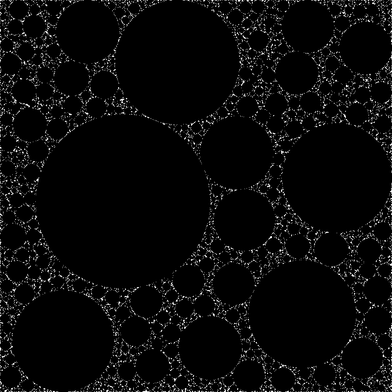

# Circle Packing
## How does it work
The program always picks a random point and then calculates the max radius depending on the borders and the other circles.  
It also doesn't draw a circle if its inside another one.
## screenshot
1 million tries

## inspiration

